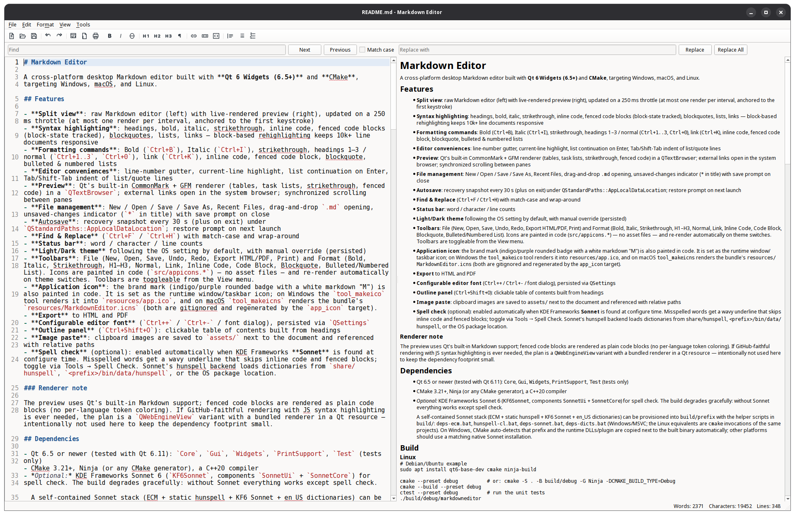

# Markdown Editor

Write beautifully, everywhere. Markdown Editor is a **free, open-source writing app** for notes, documents, and READMEs — you type in plain text on the left, and a polished preview appears live on the right. No accounts, no subscriptions, no internet required. It runs on **Windows, macOS, and Linux**, follows your system's light/dark mode, and exports your work to HTML or PDF.

Ready-to-install packages are published on the [Releases page](https://github.com/mjselan/MdEditor/releases) as they become available (Linux available now).



> **For developers:** built with Qt 6 Widgets and CMake (C++20). Build instructions for each platform, plus packaging and project internals, are documented below.

## Features

- **Split view**: raw Markdown editor (left) with live-rendered preview (right), updated on a 250 ms throttle (at most one render per interval, anchored to the first keystroke)
- **Syntax highlighting**: headings, bold, italic, strikethrough, inline code, fenced code blocks (block-state tracked), blockquotes, lists, links — block-based rehighlighting keeps 10k+ line documents responsive
- **Formatting commands**: Bold (`Ctrl+B`), Italic (`Ctrl+I`), strikethrough, headings 1–3 / normal (`Ctrl+1..3`, `Ctrl+0`), link (`Ctrl+K`), inline code, fenced code block, blockquote, bulleted & numbered lists
- **Editor conveniences**: line-number gutter, current-line highlight, list continuation on Enter, Tab/Shift-Tab indent of list/quote lines
- **Preview**: Qt's built-in CommonMark + GFM renderer (tables, task lists, strikethrough, fenced code) in a `QTextBrowser`; external links open in the system browser; synchronized scrolling between panes
- **File management**: New / Open / Save / Save As, Recent Files, drag-and-drop `.md` opening, unsaved-changes indicator (`*` in title) with save prompt on close
- **Autosave**: recovery snapshot every 30 s (plus on exit) under `QStandardPaths::AppLocalDataLocation`; restore prompt on next launch
- **Find & Replace** (`Ctrl+F` / `Ctrl+H`) with match-case and wrap-around
- **Status bar**: word / character / line counts
- **Light/Dark theme** following the OS setting by default, with manual override (persisted)
- **Toolbars**: File (New, Open, Save, Undo, Redo, Export HTML/PDF, Print) and Format (Bold, Italic, Strikethrough, H1–H3, Normal, Link, Inline Code, Code Block, Blockquote, Bulleted/Numbered List). Icons are painted in code (`src/appicons.*`) — no asset files — and re-render automatically on theme switches. Toolbars are toggleable from the View menu.
- **Application icon**: the brand mark (indigo/purple rounded badge with a white markdown "M") is also painted in code. It is set as the runtime window/taskbar icon; on Windows the `tool_makeico` tool renders it into `resources/app.ico`, and on macOS `tool_makeicns` renders the bundle's `resources/MarkdownEditor.icns` (both are gitignored and regenerated by the `app_icon` target).
- **Export** to HTML and PDF
- **Configurable editor font** (`Ctrl++` / `Ctrl+-` / font dialog), persisted via `QSettings`
- **Outline panel** (`Ctrl+Shift+O`): clickable table of contents built from headings
- **Image paste**: clipboard images are saved to `assets/` next to the document and referenced with relative paths
- **Spell check** (optional): enabled automatically when KDE Frameworks **Sonnet** is found at configure time. Misspelled words get a wavy underline that skips inline code and fenced blocks; toggle via Tools → Spell Check. Sonnet's hunspell backend loads dictionaries from `share/hunspell`, `<prefix>/bin/data/hunspell`, or the OS package location.

### Renderer note

The preview uses Qt's built-in Markdown support; fenced code blocks are rendered as plain code blocks (no per-language token coloring). If GitHub-faithful rendering with JS syntax highlighting is ever needed, the plan is a `QWebEngineView` variant with a bundled renderer in a Qt resource — intentionally not used here to keep the dependency footprint small.

## Dependencies

- Qt 6.5 or newer (tested with Qt 6.11): `Core`, `Gui`, `Widgets`, `PrintSupport`, `Test` (tests only)
- CMake 3.21+, Ninja (or any CMake generator), a C++20 compiler
- *Optional:* KDE Frameworks Sonnet 6 (`KF6Sonnet`, components `SonnetUi` + `SonnetCore`) for spell check. The build degrades gracefully: without Sonnet everything works except spell check.

  A self-contained Sonnet stack (ECM + static hunspell + KF6 Sonnet + en_US dictionaries) can be provisioned into `build/prefix` with the helper scripts in `build/`: `deps-ecm.bat`, `hunspell-cl.bat`, `deps-sonnet.bat`, `deps-dicts.bat` (Windows/MSVC; the Linux equivalents are `cmake` invocations of the same projects). On Windows, CMake auto-detects that prefix and the runtime DLLs/plugin are copied next to the built binary automatically; other platforms should use a matching native Sonnet installation.

## Build

### Linux

```bash
# Debian/Ubuntu example
sudo apt install qt6-base-dev cmake ninja-build

cmake --preset debug          # or: cmake -S . -B build/debug -G Ninja -DCMAKE_BUILD_TYPE=Debug
cmake --build --preset debug
ctest --preset debug          # run the unit tests
./build/debug/markdowneditor
```

If Qt is in a non-standard location, set `CMAKE_PREFIX_PATH` (the presets read the `QT_DIR` environment variable):

```bash
QT_DIR=~/Qt/6.11.1/gcc_64 cmake --preset debug
```

### Windows (MSVC)

1. Install Qt 6.x (MSVC flavor), Visual Studio 2022+ with C++ tools, and CMake/Ninja (bundled with Qt under `Tools`).
2. From a shell with the MSVC environment initialized:

```bat
call "C:\Program Files\Microsoft Visual Studio\18\Community\VC\Auxiliary\Build\vcvars64.bat"
set QT_DIR=C:\Qt\6.11.1\msvc2022_64
set PATH=C:\Qt\Tools\Ninja;%PATH%

cmake --preset debug
cmake --build --preset debug
ctest --preset debug
build\debug\markdowneditor.exe
```

The repository also ships a local helper script (not tracked, under the gitignored `build/` tree pattern): `build\devcmd.bat` wraps any command with the MSVC + Qt environment, e.g. `build\devcmd.bat cmake --build --preset debug`.

### macOS

```bash
brew install qt cmake ninja
QT_DIR="$(brew --prefix qt)" cmake --preset debug
cmake --build --preset debug
./build/debug/MarkdownEditor.app/Contents/MacOS/MarkdownEditor
```

The macOS target is a real application bundle (`*.app`), so it can be opened
from Finder, launched from a DMG, and deployed with Qt's `macdeployqt` tool.
The scripts in `Installer/MacOS/` also accept a Qt installation selected
through `QT_DIR`; when `cmake` is not on `PATH`, the packaging script looks in
the Qt kit's bundled CMake tools.

## Packaging & installation (Windows)

Windows ships are produced with **Qt Installer Framework 4.x** (installed with Qt under `Tools\QtInstallerFramework`; the scripts use 4.11). The Windows-specific files live in `Installer/Windows/` and are driven by two scripts run through the `devcmd.bat` environment wrapper:

```bat
rem 1. Build the Release preset and stage a self-contained app tree
rem    (windeployqt6 DLLs + plugins, MSVC CRT DLLs, Sonnet spell-check stack).
build\devcmd.bat Installer\Windows\windeploy.bat

rem 2. Assemble the offline installer (binarycreator).
build\devcmd.bat Installer\Windows\make-installer.bat
```

The result is `Installer\Windows\MarkdownEditor-<version>-offline.exe` (~54 MB; version parsed from `CMakeLists.txt`). No `vc_redist` bootstrapper is needed — the CRT DLLs (`vcruntime140.dll`, `vcruntime140_1.dll`, `msvcp140.dll`) are bundled next to the exe. What exactly gets staged is detailed in [docs/packaging.md](docs/packaging.md).

### Installing

GUI: run the exe and follow the wizard (target dir defaults to `C:\Program Files\MarkdownEditor`). Silent/automated install:

```bat
Installer\Windows\MarkdownEditor-<version>-offline.exe install --default-answer --confirm-command TargetDir=C:/path/to/install
```

The installer creates a **Markdown Editor** Start Menu group with app + uninstall shortcuts (via `Installer\Windows\packages\com.mdeditor.markdowneditor\meta\installscript.qs`; elevated installs go to `C:\ProgramData\...\Start Menu\Programs`, per-user installs to the roaming equivalent). Uninstall runs `maintenancetool.exe` (from the Start Menu group or the install dir); shortcuts and files are removed together.

To refresh an existing installation in place, run the new installer and pick *Update*/*Repair* — or uninstall first. The app itself is portable: the installed tree runs from any writable directory.

## Packaging & installation (macOS)

The macOS packaging flow mirrors the Windows flow: build and deploy the
application first, then assemble the installer payload.

```bash
# QT_DIR is optional when qmake6/qmake or Homebrew Qt is on PATH.
export QT_DIR="$(brew --prefix qt)"       # omit if Qt is already discoverable
./Installer/MacOS/macdeploy.sh                  # build Release, create .app, deploy Qt
./Installer/MacOS/make-installer.sh             # create a native drag-and-drop DMG
```

The generated `.dmg` and staged app are ignored build artifacts; rerun the
scripts to recreate them. Deploy steps, installer formats, and signing notes
are detailed in [docs/packaging.md](docs/packaging.md).

For a locally testable installer without Qt Installer Framework, run:

```bash
./Installer/MacOS/macdeploy.sh
./Installer/MacOS/make-installer.sh --dmg
open Installer/MacOS/MarkdownEditor-*.dmg
```

Ad-hoc signing is sufficient for local testing; see [docs/packaging.md](docs/packaging.md) for distribution signing.

## Packaging & installation (Linux / Ubuntu 24.04+)

Linux ships are produced with **Qt Installer Framework 4.11** (installed
with Qt under `Tools/QtInstallerFramework`; the scripts default to 4.11).
The Linux-specific files live in `Installer/Linux/` and mirror the macOS
flow: deploy the application first, then assemble the installer payload.

```bash
# Build tools on Ubuntu 24.04+
sudo apt install cmake ninja-build patchelf \
  libxcb-cursor0 libxcb-icccm4 libxcb-image0 libxcb-keysyms1 \
  libxcb-randr0 libxcb-render0 libxcb-render-util0 libxcb-shape0 \
  libxcb-shm0 libxcb-sync1 libxcb-util1 libxcb-xfixes0 libxcb-xkb1 \
  libx11-6 libx11-xcb1 libxkbcommon0 libxkbcommon-x11-0 \
  libwayland-client0 libwayland-cursor0 libwayland-egl1 \
  libegl1 libgl1 libopengl0 libdrm2 \
  libfontconfig1 libfreetype6 libglib2.0-0t libdbus-1-3

# 1. Build Release and stage a self-contained app tree
#    (binary + Qt libs via ldd, plugins, qt.conf with RPATH $ORIGIN/lib,
#    icon, optional Sonnet dictionaries).
QT_DIR=$HOME/Qt/6.11.1/gcc_64 ./Installer/Linux/linuxdeploy.sh

# 2. Assemble the offline installer (binarycreator).
./Installer/Linux/make-installer.sh
```

The result is `Installer/Linux/MarkdownEditor-<version>-offline.run`
(self-contained, ~60–90 MB). Install with:

```bash
chmod +x Installer/Linux/MarkdownEditor-*-offline.run
./Installer/Linux/MarkdownEditor-*-offline.run
```

The default target dir is `~/MarkdownEditor` (no sudo needed); pass
`--root /opt/MarkdownEditor` for a system-wide install. The installer
registers a `Markdown Editor` desktop entry in
`~/.local/share/applications/` (removed on uninstall) pointing at the
bundled `markdowneditor.png` icon. Silent/automated install:

```bash
./Installer/Linux/MarkdownEditor-*-offline.run install \
  --accept-licenses --default-answer --confirm-command TargetDir=$HOME/MarkdownEditor
```

Staging contents, troubleshooting, and Ubuntu compatibility notes live in
[docs/packaging.md](docs/packaging.md).

## Project layout

```
CMakeLists.txt          Root build file (AUTOMOC/UIC/RCC enabled, no manual moc calls)
CMakePresets.json       debug / release presets (Ninja, tests on in debug)
Installer/
  README.md            Platform-specific installer layout
  Windows/
    config/config.xml   Windows Qt IFW configuration
    packages/com.mdeditor.markdowneditor/
      meta/             Windows package metadata, shortcuts, GPL text
      data/             windeploy payload (gitignored)
    windeploy.bat       Windows Release build + staging
    make-installer.bat  Windows binarycreator invocation
  MacOS/
    config/config.xml   macOS Qt IFW configuration
    packages/com.mdeditor.markdowneditor/
      meta/             macOS package metadata, GPL text
      data/             macdeploy payload (gitignored)
    macdeploy.sh        macOS Release build + .app staging
    make-installer.sh   macOS IFW or native drag-and-drop DMG
  Linux/
    config/config.xml   Linux Qt IFW configuration
    packages/com.mdeditor.markdowneditor/
      meta/             Linux package metadata, desktop entry, GPL text
      data/             linuxdeploy payload (gitignored)
    linuxdeploy.sh      Linux Release build + Qt bundling (ldd/patchelf)
    make-installer.sh   Linux binarycreator invocation (.run)
tools/makeico/          Generates resources/app.ico from the code-painted icon
tools/makeicns/         Generates resources/MarkdownEditor.icns on macOS
src/
  main.cpp              Entry point
  mainwindow.*          Menus, toolbar, status bar, file management, export, autosave, settings
  markdowneditor.*      QPlainTextEdit subclass: formatting commands, gutter, image paste
  markdownhighlighter.* QSyntaxHighlighter subclass: markdown rules + block states
  markdownpreview.*     QTextBrowser subclass: debounced render, scroll sync, relative images
  outlinepanel.*        Heading outline (QDockWidget contents)
  findreplacebar.*      Find & replace bar
  theme.*               Light/dark palettes and syntax colors
  spellchecker.*        Optional Sonnet facade (no-op when compiled without)
tests/
  test_core.cpp         QtTest suite (parsing helpers, block states, theme)
```

## Configuration

Settings persist via `QSettings` (org `MdEditor`, app `MarkdownEditor`): window geometry, theme mode, editor font, outline visibility, recent files. Autosave/recovery files live under `QStandardPaths::AppLocalDataLocation` (e.g. `%LOCALAPPDATA%\MdEditor\MarkdownEditor` on Windows).

## License

Markdown Editor is free software licensed under the **GNU General Public License v3 or later** — see [LICENSE.md](LICENSE.md). The Windows, macOS, and Linux installers present the same license for acceptance during setup.
